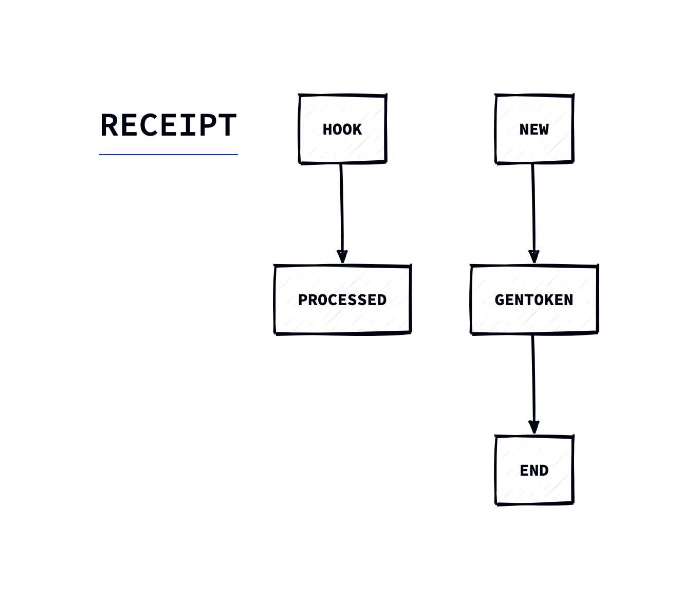

<h1 align="center">Auto Receive Crypto Pay</h1>
<h4 align="center">加密货币收款服务，直接的点对点接收，到账后自动执行动作，自托管。</h4>


## 简介
通过[流行的节点服务](https://ethereum.org/en/developers/docs/nodes-and-clients/nodes-as-a-service/#popular-node-services)监听地址转账活动，
当 `入账地址ToAddress` 收到加密货币后， `Node Services` 回调 `https://your_domain/webhook` 接口，
先对回调请求落库，然后检查并进行地址匹配，为 `发送地址FromAddress` 执行一些逻辑(譬如：生成相关订阅token，发送产品卡密等）。


## 特点
- 完全地点对点收款，无传统的中间平台
- 无需KYC，无需用户注册
- 无中介(只是依赖节点服务商推送，自接入区块链要求较高，成本也比较高，不推荐)
- 无费用(除网络费用)
- 开源，自托管，完全控制
- 支持多种网络，多种加密货币
  - 实际上您只需自行选择节点服务商，配置回调地址即可

## 快速使用

```sh
# webhook 回调
curl -X POST http://localhost:8080/webhook \
-H "Content-Type: application/json" \
--data @hook.json
```

```sh
# 根据转账地址查询token
bash -c 'curl -s "$1" | python -m json.tool' \
-- "http://localhost:8080/query_token?from_address=0x71660c4005ba85c37ccec55d0c4493e66fe775d3"
```
```shell
# response:
{
    "Token": "d53de27ac97af3ace6680b7e000597b2",
    "ValidFrom": 1726030163,
    "ValidTo": 1728622163
}
```

## 配置文件
```toml
[global]
mode = "debug"
logPath = "log/water.log"
addr = "127.0.0.1:8080"
# 您的收款地址，可配置多个
adminAddress = [
    "0x7853b3736edba9d7ce681f2a90264307694f97f2",
]

[mysql]
user = "your_user"
password = "your_password"
host = "gateway01.ap-northeast-1.prod.aws.tidbcloud.com"
port = 4000
dbName = "your_db"
maxIdleConns = 10
maxOpenConns = 100
tls = true

[rmq]
user = "your_user"
password = "your_password"
host = "cougar.rmq.cloudamqp.com"
vhost = "/psnbxfjg"
port = 5672
queue = "your_queue"
```

## 建设中
- 前端页面
- Docker快速部署
- Step by Step 文档

## 二次开发
- 我想拓展一些能力：核心逻辑定义 fsm 状态机，并实现状态处理器
- 我想嵌入到我的电子商务网站中：二次开发接入到您的订阅服务或者电子商务网站中，为网站支持接收加密货币付款渠道，简要流程如下：
  - 1. 用户在您的网站注册，并绑定用户的支付地址
  - 2. 展示管理员支付信息(收款地址、网络、币种)
  - 3. 用户自行发起转账动作
  - 4. 转账成功，`Auto Receive Crypto Pay` 接到 `node services` 回调，为 `发送地址FromAddress` 执行逻辑(生成订阅token，为用户发送卡密商品等)


## 从源码构建与运行
假设您已经安装了 Go，那么你可以打开命令行界面，执行如下命令：
```shell
git clone https://github.com/HEUDavid/auto-receive-crypto-pay.git
cd auto-receive-crypto-pay

# 编译
go build cmd/main.go

# 运行
./main
```
交叉编译参看Golang官方文档

# 可靠性说明
参看 `go-fsm框架` [说明](https://github.com/HEUDavid/go-fsm?tab=readme-ov-file#reliability-statement)

## 联系我
admin@mdavid.cn