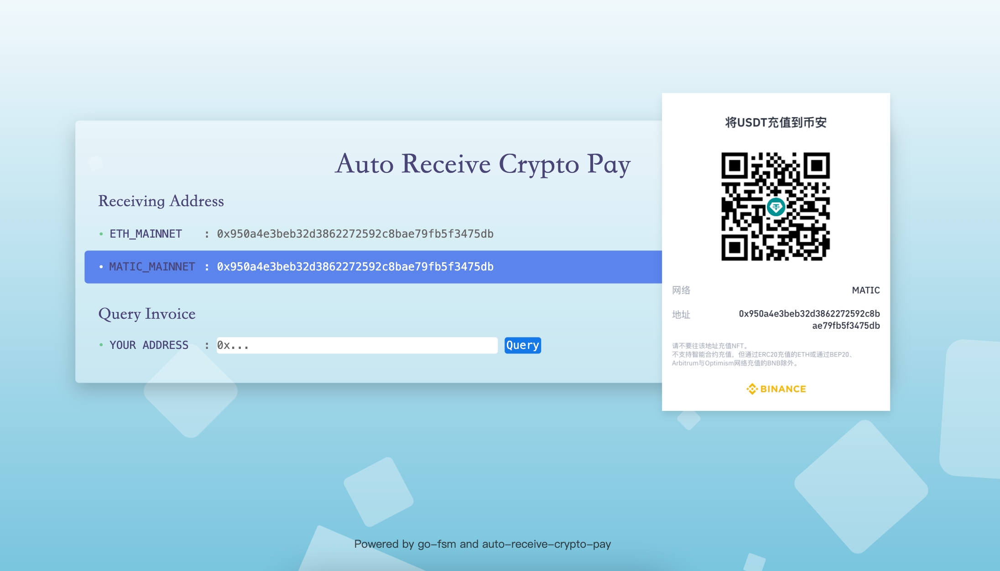

<h1 align="center">Auto Receive Crypto Pay</h1>
<h4 align="center">加密货币收款，点对点接收，实时监听到账，自托管。</h4>

#### 中文 | English

## 简介
通过[流行的节点服务](https://ethereum.org/en/developers/docs/nodes-and-clients/nodes-as-a-service/#popular-node-services)监听地址转账活动，
当 `入账地址ToAddress` 收到加密货币后， `Node Services` 回调 `https://your_domain/webhook` 接口，
先对回调请求落库，然后检查并进行地址匹配，为 `发送地址FromAddress` 执行一些逻辑(譬如：生成发票收据、生成相关订阅token、发送虚拟商品卡密等)。


收款与查询页面：https://api.mdavid.cn/gin/pay



## 特点
- 完全地点对点收款，无传统的中间平台
- 无需KYC，无需用户注册
- 无中介(只是依赖节点服务商推送，自接入区块链要求较高，成本也比较高)
- 无费用(除网络费用)
- 开源，自托管，完全控制
- 支持多种网络，多种加密货币
  - 实际上您只需自行选择节点服务商，配置回调地址即可
- 无钱包集成
  - 在我看来，钱包授权行为可能会给用户资产带来风险，因此该项目是 `push payment system`

## 快速使用
```shell
# 以 Linux 版本部署为例
wget -4 https://github.com/HEUDavid/auto-receive-crypto-pay/releases/latest/download/receivepay-linux-amd64.tar.gz
mkdir -p receivepay && tar -xzf receivepay-linux-amd64.tar.gz -C receivepay

# 修改配置
cp conf.toml.example conf.toml

# 启动进程
./receivepay-linux-amd64
```

搭配 nginx
```conf
location /gin {
    proxy_pass http://127.0.0.1:8080;
    proxy_set_header Host $host;
    proxy_set_header X-Real-IP $remote_addr;
    proxy_set_header X-Forwarded-For $proxy_add_x_forwarded_for;
    proxy_set_header X-Forwarded-Proto $scheme;
}
```
注意 `location /gin` `http://127.0.0.1:8080` 与 配置文件中 `hostRoot` `addr` 保持一致

接口测试
```sh
# webhook 回调(做好安全防护)
curl -X POST http://localhost:8080/webhook?auth=auth_key \
     -H "Content-Type: application/json" \
     --data @data/Test_ETH_MAINNET.json
```

```sh
# 根据转账地址查询 invoice
bash -c 'curl -s "$1" | python -m json.tool' \
     -- "http://localhost:8080/query_invoice?from_address=0x71660c4005ba85c37ccec55d0c4493e66fe775d3"
```
```shell
# response:
[
  {
    "Network": "ETH_MAINNET",
    "FromAddress": "0x71660c4005ba85c37ccec55d0c4493e66fe775d3",
    "ToAddress": "0x950a4e3beb32d3862272592c8bae79fb5f3475db",
    "Asset": "USDC",
    "Value": 2400,
    "InvoiceID": "50fbbb33a3ec9865f79b5a0235ef5e42",
    "ValidFrom": "2024-09-15T09:11:00+08:00",
    "ValidTo": "2024-10-15T09:11:00+08:00",
    "TransactionTime": "2024-09-15T09:10:55+08:00",
    "Content": "50fbbb33a3ec9865f79b5a0235ef5e42",
    "Valid": true
  }
]
```
也可以通过 `Node Service` Dashboard 发送测试消息来测试

## 配置文件
```toml
[global]
mode = "debug"  # debug release test
logPath = "log/water.log"
addr = "127.0.0.1:8080"
hostRoot = "/gin"  # ""或"/abc"这样

[adminAddress]  # 管理员收款地址: (网络：<地址，图片链接>)
MATIC_MAINNET = [
  { address = "0x950a4e3beb32d3862272592c8bae79fb5f3475db", url = "https://api.mdavid.cn/gin/src/MATIC.JPG" }
]
ETH_MAINNET = [
  { address = "0x950a4e3beb32d3862272592c8bae79fb5f3475db", url = "https://api.mdavid.cn/gin/src/ETH.JPG" }
]

[mysql]
user = "your_user"
password = "your_password"
host = "gateway01.ap-northeast-1.prod.aws.tidbcloud.com"
port = 4000
dbName = "your_db"
maxIdleConns = 10
maxOpenConns = 100
tls = true

[rmq]
user = "your_user"
password = "your_password"
host = "cougar.rmq.cloudamqp.com"
vhost = "/psnbxfjg"
port = 5672
queue = "your_queue"
```

## DB初始化

[init.sql](./model/init.sql)

## 从源码构建

假设您已经安装了 Go，那么可以打开命令行界面，执行如下命令：
```shell
git clone https://github.com/HEUDavid/auto-receive-crypto-pay.git
cd auto-receive-crypto-pay

go build cmd/main.go

./main
```
交叉编译参看Golang官方文档

## 二次开发
- 我想拓展一些能力
  - 核心逻辑定义 fsm 状态机，增加对应节点及其状态处理器
- 我想嵌入到我的电子商务网站中
  - 二次开发接入到您的订阅服务或者电子商务网站中，为网站支持接收加密货币付款渠道，简要流程参考：
    1. 用户在您的网站注册，并绑定用户的支付地址(类似于传统的收集用户的支付信息)
    2. 展示管理员收款信息(收款地址、网络、币种)
    3. 用户自行发起转账动作
    4. 转账成功，`Auto Receive Crypto Pay` 接到 `Node Services` 回调，为 `发送地址FromAddress` 执行逻辑(生成发票收据、生成相关订阅token、发送虚拟商品卡密等)

# 可靠性说明
参看 `go-fsm框架` [说明](https://github.com/HEUDavid/go-fsm?tab=readme-ov-file#reliability-statement)

## TODO
- Step by Step 文档

## 联系我
admin@mdavid.cn
